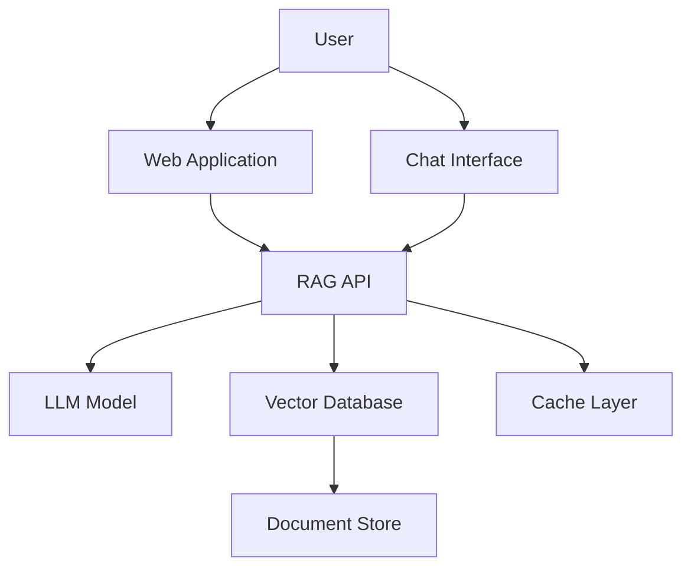

# Architecture Overview

## System Architecture Diagram

## Components

### Client Layer
- **Web Application** - Frontend interface for user interactions
- **Chat Interface** - User-facing chat UI for RAG interactions

### API Layer
- **RAG API** - Core API handling RAG operations and request routing

### Processing Layer
- **LLM Model** - Large Language Model for generating responses
- **Vector Database** - Stores embeddings for semantic search
- **Document Store** - Retrieves and manages documents for context

### Infrastructure
- **Cache Layer** - In-memory caching for improved performance

## Data Flow

1. User submits a query through the Chat Interface
2. Query is sent to the RAG API
3. API converts query to embeddings
4. Vector Database retrieves relevant documents
5. Documents are fetched from Document Store
6. Context and query are sent to LLM Model
7. LLM generates response based on context
8. Response is returned to user through Chat Interface